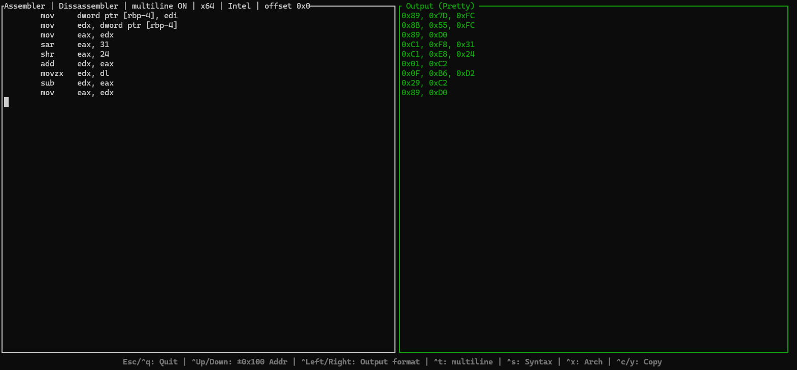
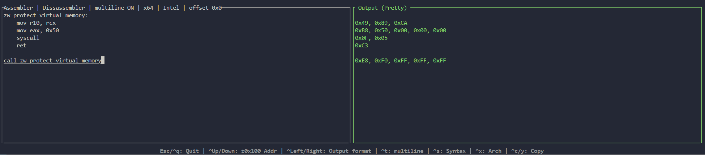
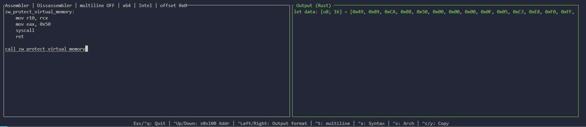

# Quick-asm
Quick-asm or `qasm` is a simple CLI / TUI tool for quickly assembling and disassembling input.

It supports `x86` and `x86_64` with `Intel` and `AT&T` Syntaxes.

It's build on top of Capstone and Keystone with the GUI being powered by Ratatui.

You can run it interactively by not specifying data, or you can use it as a one-shot machine by writing what you want to assemble/disassemble as an argument. The tool does its best to determine the type of data.

It supports a variety of output formats, ranging from raw hex to language specific representations.

## Quickstart
Download the executable from the releases tab or compile the project to get started.

The following arguments are supported:
```md
# Bitness, x86 or x64
--mode 32 / 86 / 64

# Assembly syntax
--syntax intel / att

# Output format
--format pretty / raw-hex / rust-vector / c-style-array / string-literal

# Used for the start of assembling / disassembling 
--address u64
```

These settings can also be changed during interactive mode with the help of keybinds, or pre-seeded with commandline arguments.

### Example one-shot usage
```bash
$ qasm mov rax, 0xff
0x48, 0xC7, 0xC0, 0xFF, 0x00, 0x00, 0x00
```
Or the other way around
```bash
$ qasm 0x0F, 0x05
syscall
```
It will automatically parse the input 
```bash
$ qasm 0x48C7C0FF000000
mov rax, 0xff
```

### Binds in TUI mode
The current binds, which are also visible at runtime are as follows
- `^q`: Quit
- `^t`: Multiline mode toggle
- `^s`: Syntax toggle
- `^x`: Architecture toggle
- `^c`: Copy output buffer
- `Up/Down`: ±0x100 to the address

## Screenshots




## Known issues
Changing the syntax and/or multiline mode only changes it for the output. To re-format your input, you need to change to the output panel and change the syntax. This was originally intended but this behaviour will be changed when I figure out an idiomatic way to add this functionality.
